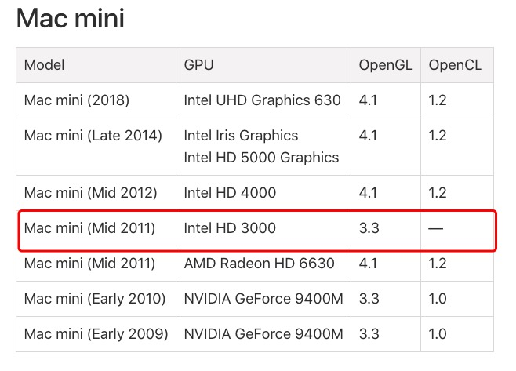

# Mac环境下Opengl的注意事项
1. 查询support 列表
   首先,我们要先到apple的[support list](https://support.apple.com/en-us/HT202823)查找本地mac支持的opengl版本信息.
   接着,我以自己的mac mini为例截图.
   我的型号是mac nini(2011)如图所示.
   

2. 代码配置*OPEGL版本*
```
// 因为使用的版本是version3.3 所以需要告诉GLFW 主版本是3
// 主版本号
glfwWindowHint(GLFW_CONTEXT_VERSION_MAJOR, 3);
// 次版本号
glfwWindowHint(GLFW_CONTEXT_VERSION_MINOR, 3);

// 告诉GLFW我们使用的是核心模式(Core-profile)
glfwWindowHint(GLFW_OPENGL_PROFILE, GLFW_OPENGL_CORE_PROFILE);
    
// 使用的是Mac OS X系统，你还需要加下面这行代码到你的初始化代码中这些配置才能起作用
glfwWindowHint(GLFW_OPENGL_FORWARD_COMPAT, GL_TRUE);
```